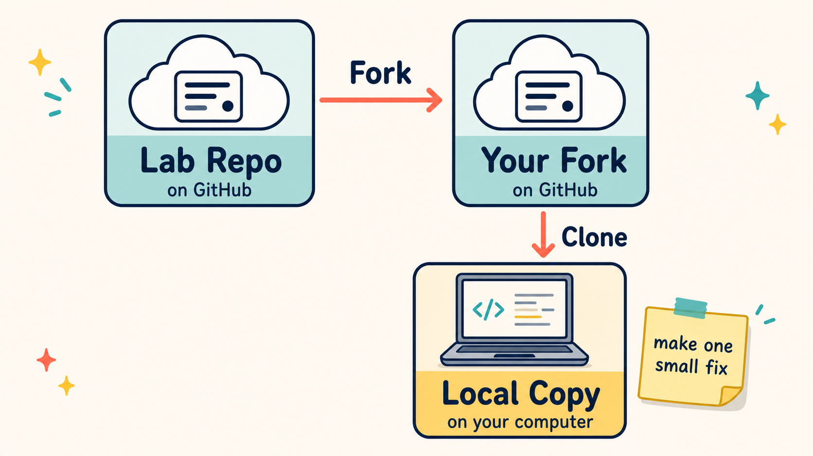
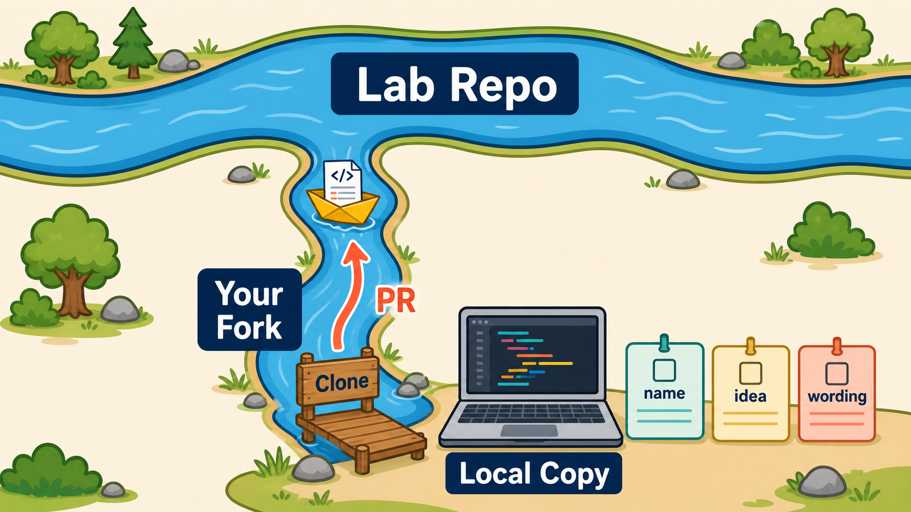

# 04 First PR

## Goal
Practice the real GitHub workflow: fork, clone, make one small fix, push, and open a pull request that explains the task you completed.

## What You Are Practicing
- What a fork is
- What `git clone`, `git add`, `git commit`, and `git push` do in a basic workflow
- How a pull request points at one specific change

## Start Here
1. [Fork this repo on GitHub](https://docs.github.com/en/pull-requests/collaborating-with-pull-requests/working-with-forks/fork-a-repo).
2. [Clone your fork](https://docs.github.com/en/repositories/creating-and-managing-repositories/cloning-a-repository).

   

3. Open `issues.md` and pick one small task.
4. Make the small change described by that issue.
5. [Commit](https://github.com/git-guides/git-commit) it, [push](https://github.com/git-guides/git-push) it, and use GitHub's guide to [open a pull request](https://docs.github.com/en/pull-requests/collaborating-with-pull-requests/proposing-changes-to-your-work-with-pull-requests/creating-a-pull-request).

   

For this lab, the source of your pull request is your fork. The target is the repo you forked from. In GitHub's pull request screen, check that the base repo is the original lab repo and the head repo is your fork.

## Stretch Goals
- Open a second PR for a different issue.
- Open a third PR for one more small issue.
- Improve the wording in this README.
